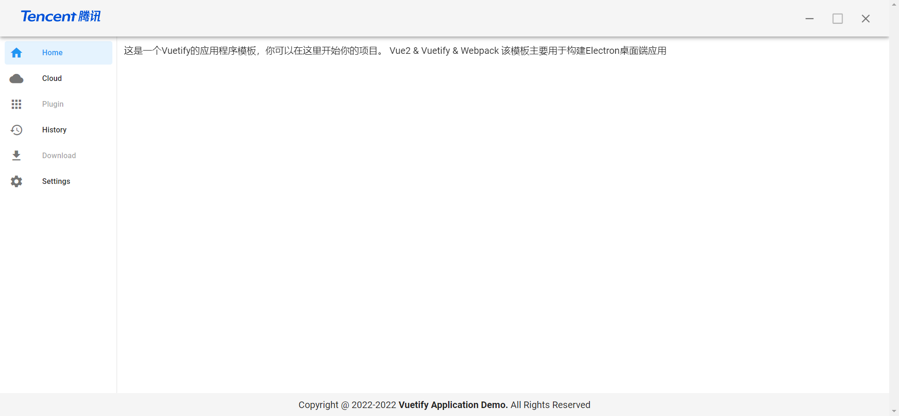

# demo-vuetify

## 介绍

这是一个Vuetify的应用程序模板，你可以在这里开始你的项目。

它包含了一些基本的配置，以及一些基本的组件。

## 技术栈

- Vue2
- Vuetify
- Vue Router

## 安装依赖

```bash
yarn install
```

## 运行

```bash
yarn serve
```

## 打包

```bash
yarn build
```

## 演示



## 项目结构

```
├── README.md
├── babel.config.js
├── package.json
├── public
│   ├── favicon.ico
│   └── index.html
├── src
│   ├── App.vue
│   ├── assets
│   │   ├── css
│   │   │   └── global.css
│   │   └── logo.png
│   ├── components
│   │   ├── asideComponents.vue  // 侧边栏组件
│   │   ├── headerComponents.vue  // 头部组件
│   │   └── footerComponents.vue  // 底部组件
│   ├── main.js
│   ├── plugins
│   │   └── vuetify.js
│   ├── router
│   │   └── index.js
│   └── views
│       ├── Main
│       │   └── index.vue
│       └── Home.vue
└── vue.config.js
```
